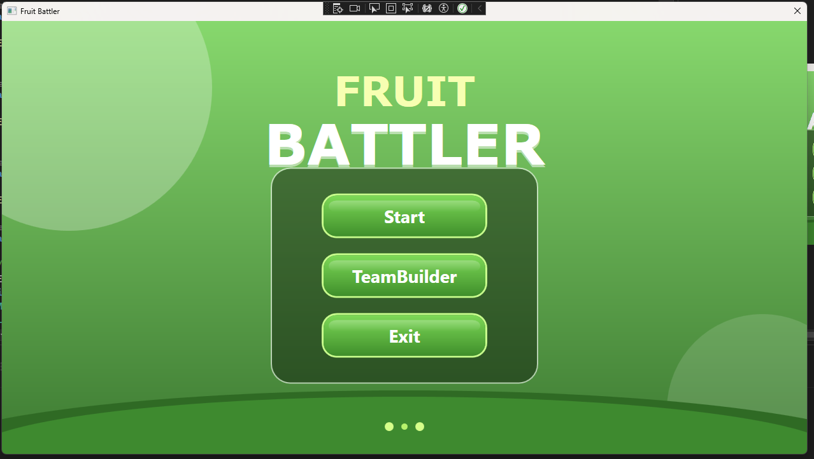
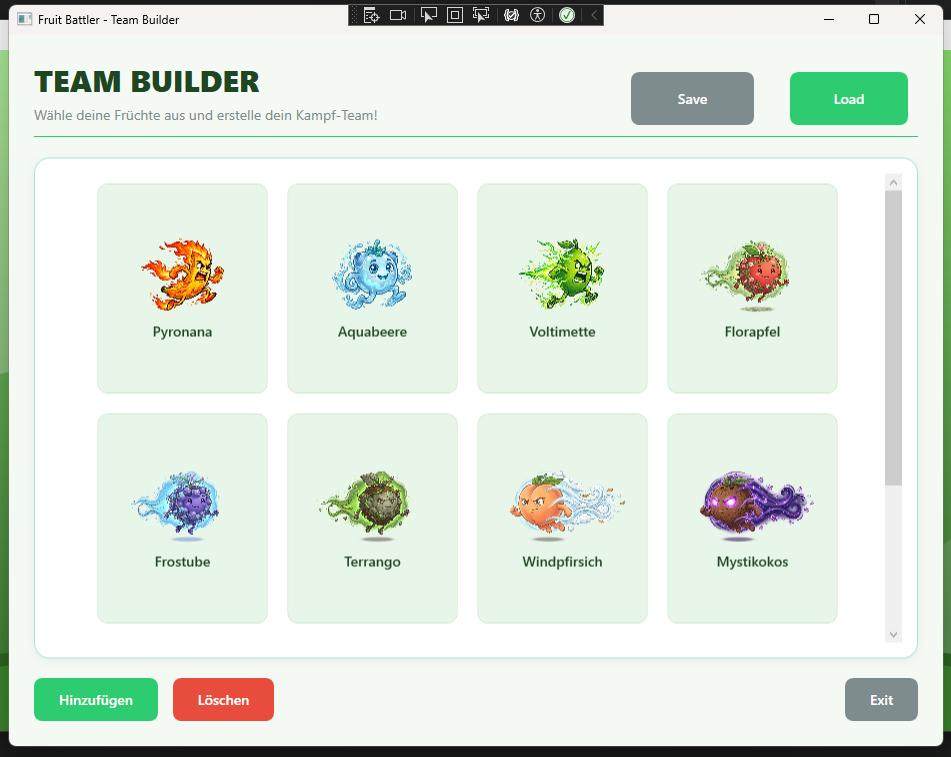
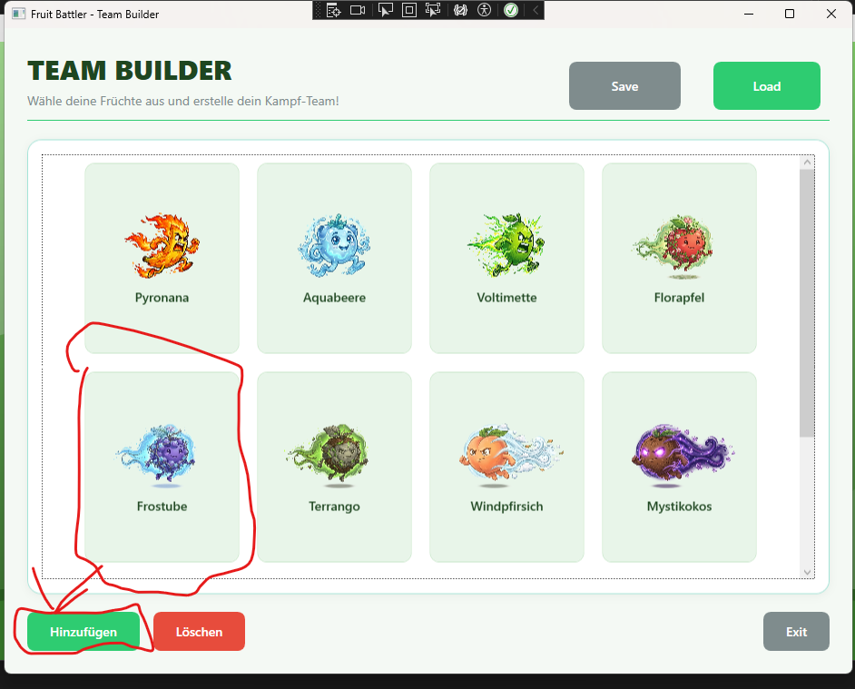
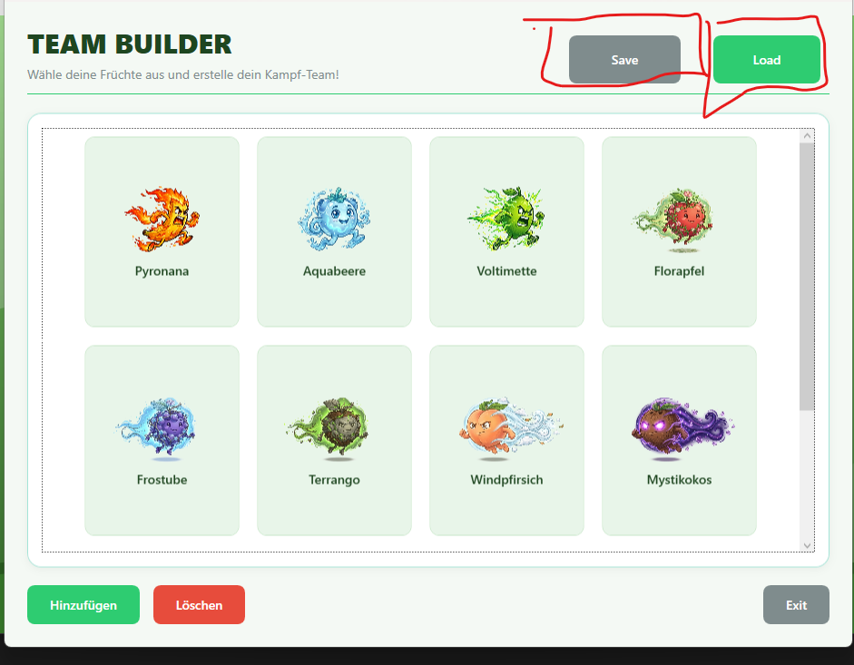
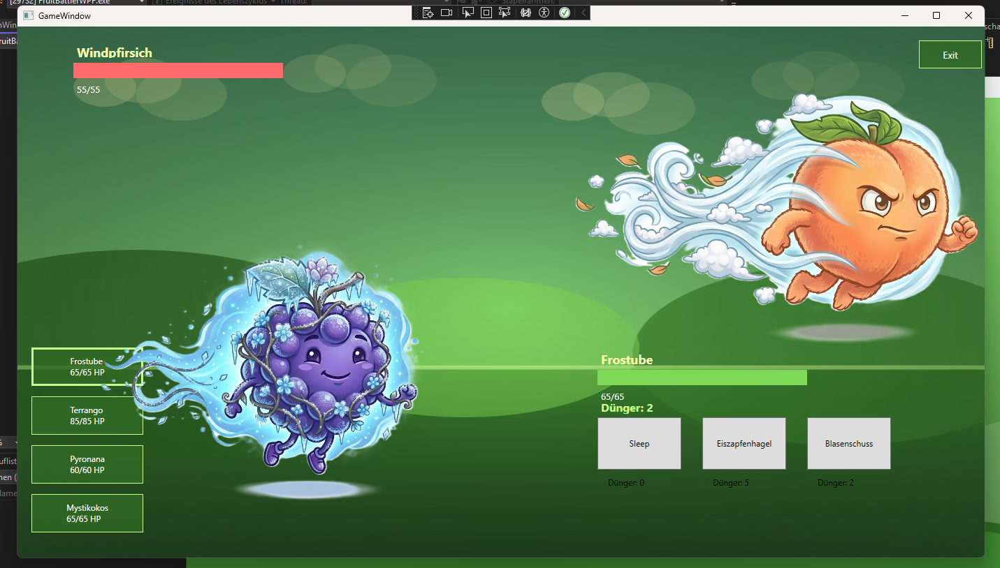
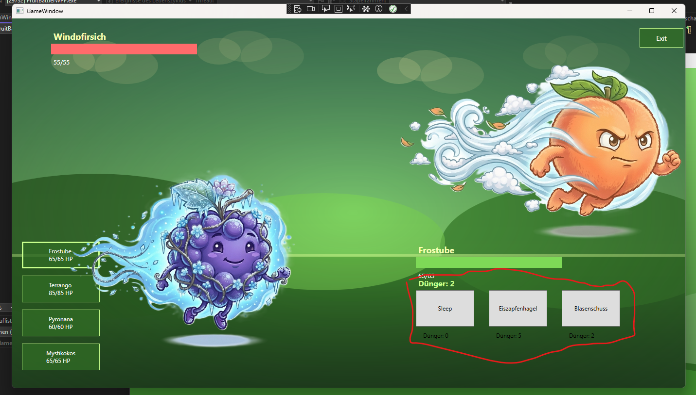

# Anleitung 

## 1. Start screen

Wenn das Spiel gestartet wird dann sieht man diesen Bildschirm welcher 3 Knöpfe hat. Der Start Button kann erst später geklickt werden sobald ein Team erstellt wurde dieses macht man beim TeamBuilder Button

## 2. TeamBuilder

Hier ist der TeamBuilder Button rot umrandet dieser muss mit einem links klick gedrückt werden um in das TeamBuilder Menü zu kommen

Hier sieht man unseren TeamBuilder hier sind alle unsere 12 verschiedenen Früchte diese werden dann zu einem Team zusammengestellt

In dem man auf eine Frucht hinaufdrückt wird diese Frucht mit einer Border markiert dann durch den Hinzufügen Button unten links kann die Frucht dem Team hinzugefügt werden. Falls man eine Frucht aus dem Team entfernen will klickt man auf die Frucht und dückt den Löschen Knopf.

Ebenfalls haben wir Save und Load Optionen hier kann man wenn man ein vollständiges Team ausgewählt hat denn save button drücken um das Team in einer Datei zu speichern. Falls man schon ein Team als Datei gespeichert hat kann das Team jederzeit wieder verwendet werden in dem man es mit dem Load Button lädt.

## 3. Game
Wenn ein vollständiges Team aus 4 Früchten ausgwählt wurde verlässt man mit dem exit Button das TeamBuilder menu und dann kann man den StartButton im Homescreen drücken

Nach dem Klick auf den StartButton kommt man in den Kampf unsere Attacken haben ein gewisses Dünger system jede runde erhaltet man wieder neu Dünger und es wird immer mehr. Jede Frucht hat die Attacke Sleep diese kostet 0 Dünger das wenn man nicht genug dünger für eine Attacke hat man immer etwas tun kann.

Hier sieht man es nochmal richtig. Wir haben nur 2 Dünger also können wir Eiszapfenhagel nicht einsetzten dann können wir entweder Sleep einsetzten und auf mehr Dünger warten oder die schwächere Attacke für 2 Dünger auswählen.

Wir haben ebenfalls due Option Früchte zu wechseln. In dem man auf einer dieser Buttons unten links klickt wird diese Frucht aus deinen Team eingewechselt dies gilt aber auch als Zug also der Gegner wird deine neu eingewechselte Frucht angreifen können ohne das du zuerst angreifen kannst
