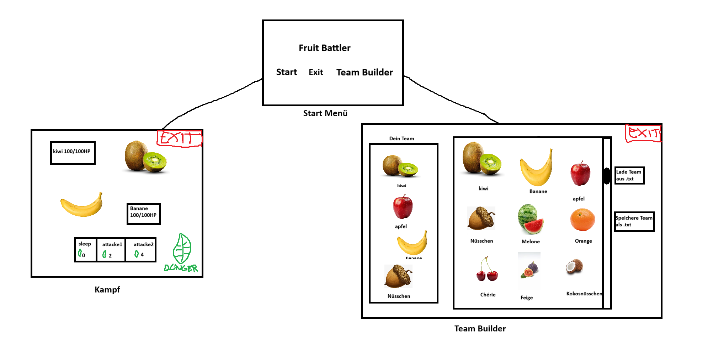

# Fruit Battler
## von Jonas und Marko

Wir planen ein Spiel in WPF zu programmieren, in welchem man mit seinem 4er Team von Früchten in jeweiligen 1v1s gegen das 4er Team an Früchten des Gegner Bots kämpft. Nach dem Tod einer Frucht kann man eine andere in den Kampf senden.
Das Spiel soll ein Turn Based Game sein, mit Früchten welche verschiedene Fruchttypen haben welche gegen andere Typen stärker oder schwächer sind, Attacken mit verschiedenen Kosten, und einem Team Builder in welchem man sein Team aus Früchten fabrizieren kann.

<!--
Source - https://stackoverflow.com/a/14747656
Posted by Tieme, modified by community. See post 'Timeline' for change history
Retrieved 2026-05-08, License - CC BY-SA 4.0
-->

## Must Haves
- 12 Früchte mit jeweiligem Typen, HP, DMG
  - Pyronana (Banane, Feuer)
  - Aquabeere (Blaubeere, Wasser)
  - Voltimette (Limette, Elektro)
  - Florapfel (Apfel, Pflanze)
  - Frostube (Trabue, Eis)
  - Terrango (Mango, Erde)
  - Windpfirsich (Pfirsich, Flug)
  - Mystikokos (Kokosnuss, Psycho)
  - Toxibirne (Birne, Gift)
  - Knacknuss (Walnuss, Gestein)
  - Schattenfeige (Feige, Unlicht)
  - Glanzkirsche (Kirsche, Licht)
- Fruchttypen haben Stärken und Schwächen, z.B. macht Feuer Wasser halben Schaden, Pflanzen doppelten,
 kriegt von Wasser doppelten und von Pflanzen halben Schaden
- Verschieden Attacken pro Frucht:
  - jede Frucht hat Attacke "Schlafen", kostet 0 und macht nix, nutzvoll zum sparen
  - eine mittelteure Attacke
  - eine teure Attacke
- einfaches Turn Based Gameplay gegen einen Bot
  - Man startet mit 2 "Dünger" was die Währung ist
  - Der Spieler darf eine Attacke für die er genügend Dünger hat spielen
  - Der Bot macht das gleiche
  - Dann kriegen der Spieler und der Bot mehr Dünger in ihre Düngerreserve
- Dünger Cycle:
  - +1 Dünger
  - +2 Dünger
  - +3 Dünger
  - +4 Dünger
  - +5 Dünger (noch ein Cycle)
  - +2 Dünger
  - +3 Dünger
  - +4 Dünger
  - +5 Dünger (noch ein Cycle)
  - +3 Dünger
  - +4 Dünger
  - +5 Dünger (noch ein Cycle)
  - +4 Dünger
  - +5 Dünger (ab hier nur noch +5 Dünger)
- Teambuilder in welchem man seine Team zusammenstellen kann
    - 4er Teams (4 verschiedene Früchte pro Team)
    - Jede Frucht maximal ein mal
    - Man kann seine Teams als .txt Datei speichern
    - Man kann .txt Dateien mit Teamdaten laden und somit sein Team reinladen

## Nice To Haves:
- Shop
- Lexikon in dem alle Früchte und deren Daten wie HP, Attacken stehen
- Chance für kritische Treffer (3x Schaden)
- Verschiedene Arenen
- Status Effekte wie Brennen, Vergiften, ...
- Intelligentere Bots
- Achievments
- Selbstheilungs "Attacken"
- Double Types (eine Frucht kann mehrere Types haben)

Das Game wird (sehr) grob so aussehen:

