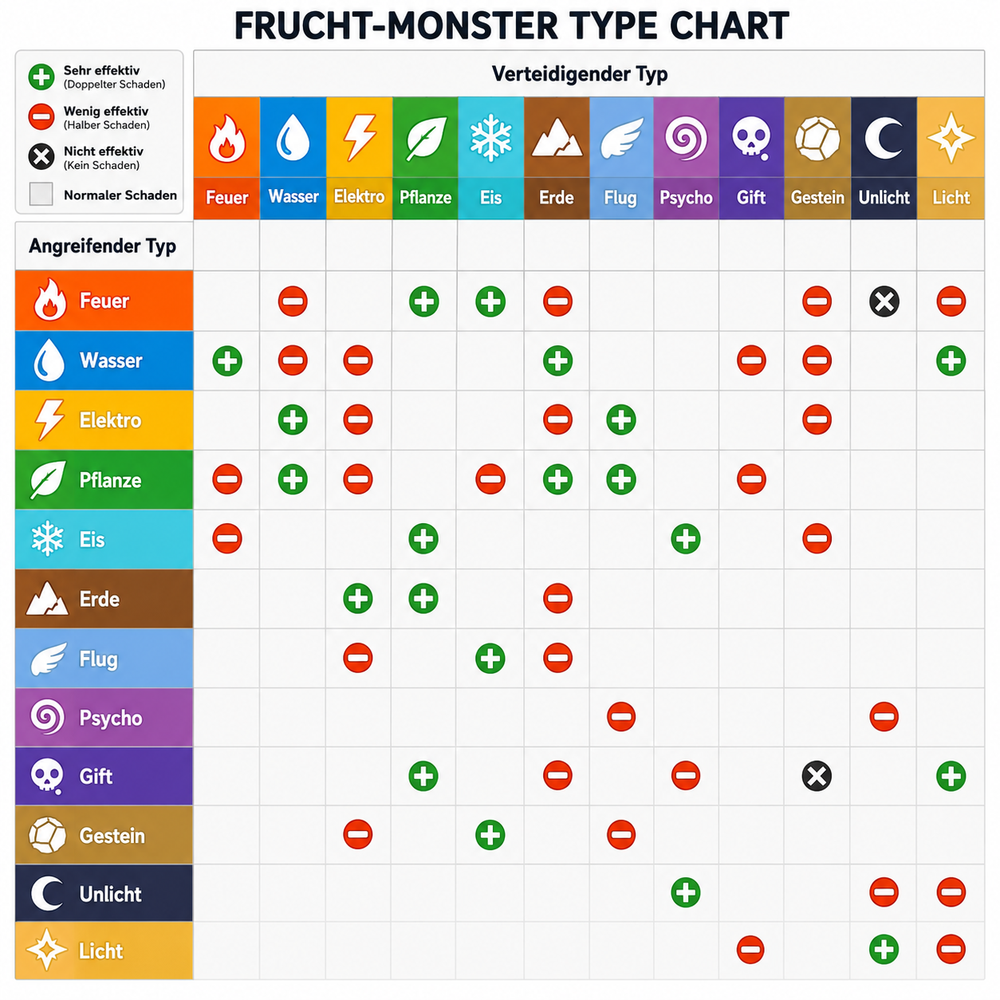

# Lastenheft / Projektidee

# Fruit Battler
## von Jonas und Marko

Wir planen ein Spiel in WPF zu programmieren, in welchem man mit seinem 4er Team von Früchten in jeweiligen 1v1s gegen das 4er Team an Früchten des Gegner Bots kämpft. Nach dem Tod einer Frucht kann man eine andere in den Kampf senden.
Das Spiel soll ein Turn Based Game sein, mit Früchten welche verschiedene Fruchttypen haben welche gegen andere Typen stärker oder schwächer sind, Attacken mit verschiedenen Kosten, und einem Team Builder in welchem man sein Team aus Früchten fabrizieren kann.


<!--
Source - https://stackoverflow.com/a/14747656
Posted by Tieme, modified by community. See post 'Timeline' for change history
Retrieved 2026-05-08, License - CC BY-SA 4.0
-->




## Must Haves
- 12 Früchte mit jeweiligem Typen, HP, DMG
  - Pyronana (Banane, Feuer)
  - Aquabeere (Blaubeere, Wasser)
  - Voltimette (Limette, Elektro)
  - Florapfel (Apfel, Pflanze)
  - Frostube (Trabue, Eis)
  - Terrango (Mango, Erde)
  - Windpfirsich (Pfirsich, Flug)
  - Mystikokos (Kokosnuss, Psycho)
  - Toxibirne (Birne, Gift)
  - Knacknuss (Walnuss, Gestein)
  - Schattenfeige (Feige, Unlicht)
  - Glanzkirsche (Kirsche, Licht)
- Fruchttypen haben Stärken und Schwächen, z.B. macht Feuer Wasser halben Schaden, Pflanzen doppelten,
 kriegt von Wasser doppelten und von Pflanzen halben Schaden
- Verschieden Attacken pro Frucht:
  - jede Frucht hat Attacke "Schlafen", kostet 0 und macht nix, nutzvoll zum sparen
  - eine mittelteure Attacke
  - eine teure Attacke
- einfaches Turn Based Gameplay gegen einen Bot
  - Man startet mit 2 "Dünger" was die Währung ist
  - Der Spieler darf eine Attacke für die er genügend Dünger hat spielen
  - Der Bot macht das gleiche
  - Dann kriegen der Spieler und der Bot mehr Dünger in ihre Düngerreserve
- Dünger Cycle:
  - +1 Dünger
  - +2 Dünger
  - +3 Dünger
  - +4 Dünger
  - +5 Dünger (noch ein Cycle)
  - +2 Dünger
  - +3 Dünger
  - +4 Dünger
  - +5 Dünger (noch ein Cycle)
  - +3 Dünger
  - +4 Dünger
  - +5 Dünger (noch ein Cycle)
  - +4 Dünger
  - +5 Dünger (ab hier nur noch +5 Dünger)
- Teambuilder in welchem man seine Team zusammenstellen kann
    - 4er Teams (4 verschiedene Früchte pro Team)
    - Jede Frucht maximal ein mal
    - Man kann seine Teams als .txt Datei speichern
    - Man kann .txt Dateien mit Teamdaten laden und somit sein Team reinladen


## Nice To Haves:
- Shop
- Lexikon in dem alle Früchte und deren Daten wie HP, Attacken stehen
- Chance für kritische Treffer (3x Schaden)
- Verschiedene Arenen
- Status Effekte wie Brennen, Vergiften, ...
- Intelligentere Bots
- Achievments
- Selbstheilungs "Attacken"
- Double Types (eine Frucht kann mehrere Types haben)

Das Game wird (sehr) grob so aussehen:


---

# Pflichtenheft: Architektur & Funktionsblöcke

## Class Diagram

KI: ChatGPT 
Prompt: Formatiere mein KlassenDiagramm schöner
und formatiere es für markdown
# Klassenübersicht – Fruit Battle Game

---

## `GameHandler`

| Sichtbarkeit | Typ         | Name                  |
| ------------ | ----------- | --------------------- |
| `+`          | `int`       | `RoundCount`          |
| `+`          | `int`       | `CurrentDungerPlayer` |
| `+`          | `int`       | `CurrentDungerEnemy`  |
| `+`          | `FruitTeam` | `PlayerTeam`          |
| `+`          | `FruitTeam` | `EnemyTeam`           |
| `+`          | `Fruit`     | `CurrentPlayerFruit`  |
| `+`          | `Fruit`     | `CurrentEnemyFruit`        |
| `+`          | `bool`      | `IsGameOver`          |

### Methoden

* `StartGame()`
* `NextRound()`
* `CalculateDamage() : int`
* `ApplyMove()`
* `HandleFaint()`
* `SwitchFruit()`
* `GetNextDungerValue() : int`


---

## `GameVisualizer`

| Sichtbarkeit | Typ      | Name            |
| ------------ | -------- | --------------- |
| `+`          | `Canvas` | `GameCanvas`    |
| `+`          | `Window` | `CurrentWindow` |

### Methoden

* `DrawBattleScene()`
* `UpdateHPBars()`
* `PlayAttackAnimation()`
* `ShowDamageText()`
* `UpdateDungerUI()`
* `SwitchMenuView()`
* `RefreshScreen()`

---

## `EnemyKI`

| Sichtbarkeit | Typ         | Name        |
| ------------ | ----------- | ----------- |
| `+`          | `FruitTeam` | `EnemyTeam` |

### Methoden

* `ChooseMove() : Move`
* `ChooseSwitchFruit() : int`
* `ShouldSwitch() : bool`

---

## `TeamBuilder`

| Sichtbarkeit | Typ         | Name          |
| ------------ | ----------- | ------------- |
| `+`          | `FruitTeam` | `CurrentTeam` |

### Methoden

* `AddFruit()`
* `RemoveFruit()`
* `ValidateTeam() : bool`
* `SaveTeam()`
* `LoadTeam()`

---

## `TeamBuilderUI`

| Sichtbarkeit | Typ           | Name              |
| ------------ | ------------- | ----------------- |
| `+`          | `List<Fruit>` | `AvailableFruits` |
| `+`          | `TeamBuilder` | `Builder`         |

### Methoden

* `DisplayFruits()`
* `AddFruitButton_Click()`
* `RemoveFruitButton_Click()`
* `SaveButton_Click()`
* `LoadButton_Click()`
* `StartGameButton_Click()`
* `UpdateTeamDisplay()`

---

## `Move`

| Sichtbarkeit | Typ         | Name          |
| ------------ | ----------- | ------------- |
| `+`          | `string`    | `Name`        |
| `+`          | `FruitType` | `Type`        |
| `+`          | `int`       | `Damage`      |
| `+`          | `int`       | `DungerCost`  |
| `+`          | `string`    | `Description` |

### Methoden

* `UseMove()`

---

## `Fruit`

| Sichtbarkeit | Typ           | Name           |
| ------------ | ------------- | -------------- |
| `+`          | `string`      | `Name`         |
| `+`          | `FruitType`   | `Type`         |
| `+`          | `int`         | `MaxHP`        |
| `+`          | `int`         | `CurrentHP`    |
| `+`          | `int`         | `Attack`       |
| `+`          | `int`         | `Defense`      |
| `+`          | `int`         | `Speed`        |
| `+`          | `bool`        | `IsAlive`      |
| `+`          | `Move[]`      | `MoveSet`      |
| `+`          | `UserControl` | `FruitControl` |

### Methoden

* `ReceiveDamage()`
* `Heal()`
* `AttackTarget()`
* `CheckAlive() : bool`
* `GetTypeMultiplier() : double`

---

## `FruitTeam`

| Sichtbarkeit | Typ       | Name               |
| ------------ | --------- | ------------------ |
| `+`          | `Fruit[]` | `Fruits`           |
| `+`          | `int`     | `ActiveFruitIndex` |

### Methoden

* `GetActiveFruit() : Fruit`
* `SwitchFruit()`
* `HasAliveFruit() : bool`
* `GetNextAliveFruit() : Fruit`

---

## `TypeEffectiveness`

| Sichtbarkeit | Typ                        | Name          |
| ------------ | -------------------------- | ------------- |
| `+`          | `Dictionary<Type, double>` | `Multipliers` |

### Methoden

* `GetMultiplier() : double`

---

## `DuengerCycle`

| Sichtbarkeit | Typ   | Name          |
| ------------ | ----- | ------------- |
| `+`          | `int` | `CurrentStep` |

### Methoden

* `GetNextValue() : int`
* `Reset()`

---

# `enum FruitType`

```csharp
enum FruitType
{
    Feuer,
    Wasser,
    Elektro,
    Pflanze,
    Eis,
    Erde,
    Flug,
    Psycho,
    Gift,
    Gestein,
    Unlicht,
    Licht
}
```

---

# Pflichtenheft: Detaillierte Umsetzungsbeschreibung

# Spielablauf

## Hauptmenü

Sobald man das Spiel startet sieht man drei Knöpfe:
- Start
- Exit
- Team Builder

### Start

Wenn man auf „Start" drückt, startet ein Kampf gegen einen Bot.  
Das Spiel kann nur gestartet werden, wenn das Team genau aus 4 Früchten besteht.

### Exit

Wenn man auf „Exit" drückt, schließt sich das Programm.

### Team Builder

Wenn man auf „Team Builder" drückt, kommt man auf eine neue Page.

Dort sieht man:
- alle verfügbaren Früchte
- links das aktuelle Team
- rechts die Speicher- und Ladeoptionen

#### Team bearbeiten

- Klickt man auf eine Frucht in der Liste, wird sie dem Team hinzugefügt.
- Klickt man links auf eine Frucht im Team, wird sie entfernt.
- Ein Team besteht aus genau 4 Früchten.

#### Speichern und Laden

Rechts gibt es:
- einen Speicher-Button
- einen Lade-Button

Diese können:
- das aktuelle Team als `.txt` Datei speichern
- ein Team aus einer `.txt` Datei laden

# Kampf-System

## Allgemein

Der Spieler kämpft gegen einen Bot.

Beide Seiten:
- starten mit 2 Dünger
- besitzen Teams aus mehreren Früchten

Es können Früchte während dem Kampf eingewechselt werden

Wenn die Lebenspunkte einer Frucht auf 0 fallen:
- wird diese aus dem Kampf gezogen
- eine neue Frucht __muss__ eingewechselt werden

Hat ein Spieler keine Früchte mehr:
- verliert dieser Spieler

Gewonnen hat:
- wer zuerst alle gegnerischen Früchte besiegt

# Früchte

Alle Früchte besitzen unterschiedliche Stats.

Die Stats sind:
- Lebenspunkte
- Angriff
- Verteidigung
- Geschwindigkeit

Jede Frucht kann außerdem unterschiedliche Attacken oder Attackentypen besitzen.

# Attacken

Es gibt mehrere Attackentypen.

Das folgende Bild zeigt das Typechart der verschiedenen Attackentypen:


Jede Frucht besitzt:
- eine kostenlose Attacke
- eine mittelteure Attacke
- eine teure Attacke

## Schlafen

Die Attacke „Schlafen":
- kostet 0 Dünger
- macht keinen Schaden
- überspringt den Zug

## Andere Attacken

Die anderen Attacken:
- kosten Dünger
- verursachen Schaden
- können je nach Attackentyp unterschiedliche Effekte besitzen

Ein Spieler kann nur Attacken auswählen, für die genug Dünger vorhanden ist.

# Zugablauf

1. Spieler wählt eine Attacke
2. Frucht mit höherer Geschwindigkeit attackiert zuerst
3. Die langsamere Frucht greift zurück an
4. Der Zug endet
5. Beide Seiten erhalten neuen Dünger

# Dünger-System

Nach jedem Zug erhalten beide Seiten Dünger.

Der Dünger-Cycle funktioniert wie folgt:

- +1 Dünger
- +2 Dünger
- +3 Dünger
- +4 Dünger
- +5 Dünger (Reset)
- +2 Dünger
- +3 Dünger
- +4 Dünger
- +5 Dünger (Reset)
- +3 Dünger
- +4 Dünger
- +5 Dünger (Reset)
- +4 Dünger
- +5 Dünger
- ab hier nur noch +5 Dünger

# Bot

Der Gegner ist ein Bot.

Der Bot:
- besitzt ebenfalls ein Team aus Früchten
- benutzt Attacken
- verwaltet Dünger wie der Spieler
- wechselt automatisch Früchte ein, wenn eine besiegt wurden

---

# Pflichtenheft: Probleme & Lösungen

# Fehler und Lösungen
## Welche Fehler hatten wir
- Ein großes Problem war das die Gegner ziemlich lang immer den falschen Move gewählt haben zuerst dachten wir das sie irgendwie zu stark sind aber es war der Fehler das sie egal wieviel Dünger sie haben immer denn starken Move wählten durch einen Fehler im Code. 
- Unsere wechsel Button gingen eine Zeit lang nicht bis wir herusgefunden haben das unsere UserControls zu groß waren und nicht durchklickbar waren und so über den Buttons gelegen sind.
- Hatten Probleme beim Speichern und beim Laden da die UserControls nicht mitspeicher bar waren dies haben wir dann mit einem JSonIgnore gefixt.

---

# Testbeschreibung

# Testbeschreibung
## Wie haben wir getestet
Wie haben unser Spiel folgendermaßen getetstet-
- Wir haben sehr viel herumprobiert geschaut kann das stimmen das wir soviel damage machen usw
- Manchmal KI drüber schauen lassen ob er Fehler im Code findet

---

# Lastenheft – FruitBattler

## 1. Projektübersicht

**Projektname:** FruitBattler  
**Genutzte Technologien:** C# / WPF
**Entwickler:** Jonas Dreher und Marko Dvorancic

FruitBattler ist ein rundenbasiertes Kampfspiel inspiriert von Pokémon Battlern. Der Spieler stellt ein Team aus 4 Früchten zusammen und kämpft gegen ein vom Computer gesteuertes gegnerisches Team aus 4 Früchten. Jede Frucht hat individuelle Stats, einen Typ und ein Moveset.


## 2. Zielbestimmung

Das Ziel des Projekts ist die Entwicklung eines funktionsfähigen rundenbasierten Kampfspiels mit grafischer Benutzeroberfläche. Der Spieler soll ein eigenes Team zusammenstellen, speichern und laden können, und anschließend gegen eine KI antreten.


## 3. Funktionale Anforderungen

### 3.1 Hauptmenü
- Der Spieler sieht beim Start ein Hauptmenü mit den Buttons Start, TeamBuilder und Exit
- Über Start wird ein Kampf gestartet
- Über TeamBuilder kann das Team zusammengestellt werden
- Über Exit wird das Programm beendet

### 3.2 TeamBuilder
- Der Spieler kann aus 12 verschiedenen Früchten wählen
- Es können genau 4 Früchte ins Team aufgenommen werden
- Keine Frucht darf doppelt im Team vorkommen
- Das Team kann gespeichert und geladen werden (json in .txt Datei)
- Geladene Teams werden automatisch mit den passenden UserControls repariert

### 3.3 Früchte
- Es gibt 12 verschiedene Früchte, jede mit einem eigenen Typ
- Jede Frucht hat eigen Stats: HP, Angriff,Verteidigung,Geschwindigkeit
- Jede Frucht hat ein Moveset aus 3 Moves: Sleep (kostenlos), ein starker Move, ein schwächerer Move
- Früchte können Schaden erhalten und sterben wenn HP auf 0 fällt

### 3.4 Typen
Es gibt 13 Typen mit einem Typechart:
Normal, Feuer, Wasser, Elektro, Pflanze, Eis, Erde, Flug, Psycho, Gift, Gestein, Unlicht, Licht

- Typen können sehr effektiv (x1.5 Schaden), nicht effektiv oder immun sein
- STAB oder Same Type Attack Bonus: Nutzt eine Frucht einen Move des eigenen Typs, erhält der Angriff einen Bonus von 1.5x

### 3.5 Kampfsystem
- Der Kampf ist rundenbasiert
- Spieler und KI wählen pro Runde je einen Move
- Moves kosten Dünger was ein Ressourcensystem ist das pro Runde ansteigt
- Der Düngerzyklus folgt einer festen Sequenz: 1,2,3,4,5,2,3,4,5,3,4,5,4,5 (danach immer 5 Dünger/Runde)
- Sleep kostet keinen Dünger und macht keinen Schaden
- Stirbt eine Frucht des Gegners dann wird automatisch die nächste lebende Frucht eingewechselt
- Das Spiel endet wenn alle Früchte eines Teams besiegt sind

### 3.6 Schadensberechnung
Wurde mit AI gemacht, da die Formel zu erstellen für uns zu schwer gewesen wäre

Schaden = (Angriff des Angreifers / Verteidigung des Verteidigers) * Schadenswert des Moves
STAB: Schaden * 1.5 wenn Fruchttyp == Movetyp
Minimum: 1 Schaden

### 3.7 Gegner-KI
- Die KI erstellt automatisch ein zufälliges Team aus 4 unterschiedlichen Früchten
- Die KI wählt Moves anhand der Typeffektivität gegen die aktive Spielerfrucht
- Bei zu wenig Dünger fällt die KI auf Sleep zurück

### 3.8 Logging
- Das Spiel loggt alle relevanten Ereignisse via Serilog
- Logs werden in die Konsole und in eine tägliche Logdatei geschrieben
- Logdateien werden 7 Tage aufbewahrt


## 4. Produktdaten

| Eigenschaft | Wert |
|---|---|
| Anzahl Früchte | 12 |
| Teamgröße | 4 |
| Anzahl Typen | 13 |
| Moves pro Frucht | 3 |
| Düngerzyklus | fest definierte sequenz |
| Logaufbewahrung | 7 Tage |

## 5. Systemvoraussetzungen

- Windows 10 oder höher
- .NET 6 oder höher
- WPF-fähiges System

---

# Pflichtenheft – FruitBattler

## 1. Softwarevoraussetzungen mit Versionen

| Software/Bilbiothek | Version |
|---|---|
| .NET | 4.8 |
| WPF (Windows Presentation Foundation) | .NET 4.8 |
| C# | 4.14.0 (C#-Tools) |
| Serilog | 4.3.1 |
| Serilog.Sinks.Console | 6.1.1 |
| Serilog.Sinks.File | 7.0.0 |
| Visual Studio | 2022 17.14.20 |
| Windows | 10 / 11 |

## 2. Architektur & Funktionsblöcke

### Projektstruktur

```
FruitBattlerWPF
  Classes
    Fruit.cs            – Frucht mit Stats, Typ und Moveset
    FruitTeam.cs        – Team aus 4 Früchten
    FruitGenerator.cs   – Erstellt alle 12 Früchte
    Move.cs             – Move mit Name, Typ, Schaden und Düngerkost
    GameHandler.cs      – Spiellogik und Rundenverwaltung
    EnemyKI.cs          – Gegner KI
    TypeEffective.cs    – Typechart
    DuengerCycle.cs     – Düngerzyklus
    Save_load.cs        – Team speichern und laden
    Logger.cs           – Logging
  Pages_window
    GameWindow.xaml         – Kampfbildschirm
    TeamBuilderWindow.xaml  – Team auswählen
  MainWindow.xaml   – Hauptmenü
  Type.cs           – Enum mit allen 13 Typen
```
### Zusammenspiel der Klassen

- **MainWindow** öffnet das **TeamBuilderWindow** und übernimmt das fertige Team
- **GameWindow** nutzt **GameHandler** für die gesamte Spiellogik
- **GameHandler** verwaltet beide Teams, den Dunger, die Rundenzahl und prüft ob das Spiel vorbei ist
- **EnemyKI** bekommt das Spielerteam und wählt anhand von **TypeEffective** den besten Move
- **Logger** wird in allen Klassen statisch aufgerufen um zu loggen


## 3. Detaillierte Umsetzungsbeschreibung

### 3.1 Schadensformel

Die Schadensberechnung in **Fruit.ReceiveDamage** funktioniert folgendermaßen:

> Schaden = (Angriff des Angreifers / Verteidigung des Verteidigers) *  > Schadenswert des Moves
> Minimum: 1 Schaden

### 3.2 Düngersystem

Der Dünger steigt pro Runde nach einer fest definierten Sequenz an:

> 1, 2, 3, 4, 5, 2, 3, 4, 5, 3, 4, 5, 4, 5 – danach immer 5


Beide Spieler (Spieler und KI) erhalten pro Runde denselben Düngerwert. Moves kosten Dünger – reicht der Dünger nicht, kann der Move nicht eingesetzt werden.

### 3.3 Typechart

Die Typeffektivität wird in **TypeEffective.cs** über ein Dictionary umgesetzt:

| Rückgabewert | Bedeutung |
|---|---|
| 1 | Sehr effektiv |
| 0 | Neutral |
| -1 | Nicht effektiv |
| -2 | Immun |

### 3.4 KI-Logik

Die KI in **EnemyKI.ChooseMove** geht das Moveset der aktiven Frucht durch und wählt den Move mit der besten Typeffektivität gegen die aktive Spielerfrucht. Kann kein Move eingesetzt werden wegen z.B. zu wenig Dpnger, fällt die KI auf Sleep zurück.

### 3.5 Automatischer Fruchtwechsel

Stirbt eine Frucht des Gegners, wird in **FruitTeam.SwitchToNextAliveFruit** automatisch die nächste lebende Frucht gesucht und als aktiv gesetzt.

### 3.6 Speichern & Laden

Das Team wird in **Save_load.cs** als JSON in eine **.txt** Datei serialisiert. Da UserControlObjekte werden beim Laden automatisch anhand des Fruchtnamens aus der **allfruits-Liste** wieder zugewiesen.

### 3.7 Team klonen

Beim Spielstart wird das Team des Spielers geklont (**MainWindow.CloneTeam**), damit nach dem Kampf die originalen Früchte unverändert bleiben und das Spiel erneut gestartet werden kann ohne das Team neu auszuwählen zu msüssen.

### 3.8 Logging

Alle relevanten Ereignisse werden über die statische **Logger**-Klasse geloggt. Serilog schreibt gleichzeitig in die Konsole und in eine tägliche Logdatei im log Ordner. Dateien werden 7 Tage aufbewahrt.

## 4. Probleme & Lösungen

- Ein großes Problem war das die Gegner ziemlich lang immer den falschen Move gewählt haben zuerst dachten wir das sie irgendwie zu stark sind aber es war der Fehler das sie egal wieviel Dünger sie haben immer denn starken Move wählten durch einen Fehler im Code. 

- Unsere wechsel Button gingen eine Zeit lang nicht bis wir herusgefunden haben das unsere UserControls zu groß waren und nicht durchklickbar waren und so über den Buttons gelegen sind.
  
- Hatten Probleme beim Speichern und beim Laden da die UserControls nicht mitspeicher bar waren dies haben wir dann mit einem JSonIgnore gefixt.

---

# Projekttagebuch

## Jonas

8.5
	Added Klassen.txt
	Added a draw.io class Diagramm
	Added the class diagram to our documentation

13.5
	Added classes Folder and the enum for type
	Added the Name_doc.txt files
	Created a good Looking MainWindow with ChatGPT
	Implemented DuengerCycle.cs

20.5
	Completed the Fruit Class 
	Gitignore verbessert
	Implemted FruitTeam

26.5
	Deleted TypeEffectinies file because we already run the calcs in the Fruit Receive Damage
	Implemted FruitTeam
	Wrote all methods for the GameHandler but have to prgramm EnemyKi first
	Reastablished TypeEffective and programmed it with ChatGPT
	programmed the EnemyKi
	

27.5
	added all the ellipses for the prototyp usercontrols
	

28.5
	Alle früchte werden geladen
	TeamBuilderUi fertig
	Fixed corrupted usercontrols
	TeamBuilder fertig Implementierd es muss nurnoch speichern und laden programmiert werden das er komplett funktioniert


2.6
	Made all the Backgrounds for the png´s transparent
	Upgraded the TeamBuilder and made it completly working added the png´s to the usercontrols and made it load into the main window and let the Start Button check if a team is in use
	Fixed the bug when you load a wrong file that the team builder is messed up
	Enemy team wird bei start erstellt
	

3.6
	Updatet my doc and made enemyKi public
	Einen bug gefixed welcher beim laden vom Team aufgefallen ist
	Früchte switchen gefixt

11.6
	Denn GameVisualizer mit claude code vom aussehen her verbessert
	

12.6
	Leben bei den switch Buttons werden nun geupdatet
	Updated my documentation

16.06 
	Bugfixes wie das Gegner falsche Moves choosen.
	Background verbessert da er zu klein war. 
	Exit Button im Spiel hinzugefügt
	Wenn Früchte sterben switchen erzwungen.
	Animationen erstellt.
	Sterben von Früchten des Gegners eingebunden das automatisch neue Früchte des Gegner eingewechslet werden.

## Marko

22.5
	Implemented Logger Class and added Serilog, Serilog.Sinks.File and Serilog.Sinks.Console to whole Project
27.5
	Added the most important Features for the GameVisualizer Class

2.6 - 7.6
	Fixed System.NullReferenceException for Enemys FruitTeam
	Added UpdateMoveButtons to GameVisualizer
	Fixed Bug with Claude where Program would throw Error because Fruit was already instanced after exiting game and re-entering,
	and where Enemy Fruit couldn't be the same as Player Fruit
	Added Labels that Show Dünger Cost below the Move Buttons
	Made and Implemented GameHandler Class and with it Made a Rough half playable Version of the game,
	testing most Features with it
	
12.06
	Made it so that if fruit is switched it also switches fruitname

19.6 - 21.06
	Added final logs and release of game in bin dir
22.06
	Noticed missing comments to label Claude AI Usage in Logger.cs Class so added it
	Made new Build of game and pushed it because I was unsure if i should do one after changing something
	in code (even if it's just comments)
